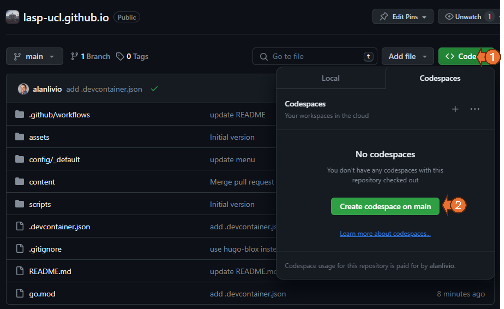

# LASP Website

LASP website built using [Hugo Blox](https://docs.hugoblox.com/) theme for Research Groups.

## 1. Setup an environment

#### Create an environment using GitHub Codespaces (recommended)

GitHub Codespaces provides a cloud-powered Visual Studio Code environment for any GitHub project. You can set up one at [project page](https://github.com/LASP-UCL/lasp-ucl.github.io) by clicking `code` and then `create codespace on main,` as below.



#### Create an environment at your local machine

- Install Hugo Extended (non-extended will fail), [see here](https://docs.hugoblox.com/getting-started/install-hugo/).
- Install python (required by `update_publication.sh`), [see here](https://www.python.org/downloads/)
- Choose and download a code editor, such [Visual Studio Code](https://code.visualstudio.com/)

## 2. Build and preview

After setting up an environment, you should run the `update_publication.sh` script to populate publications and then use the `hugo server` to preview the website, as below.

```bash
sh scripts/update_publication.sh # only once
hugo server
```

## 3. Deploy

The deployment to <http://lasp-ucl.github.io> is done by [a GitHub workflow](.github/workflows/gh-pages.yml). It is trigged automatically after push changes to GitHub.

See deployment logs (and possible fails) at the [project actions](https://github.com/LASP-UCL/lasp-ucl.github.io/actions).


## References

### About hugo-blox theme

- hugo-blox theme documentation the main page, [see here](https://docs.hugoblox.com/getting-started/page-builder/)
- hugo-blox theme docmentation for a user profile page, [see here](https://docs.hugoblox.com/tutorial/resume/step-2)
- hugo-blox theme starter for academic cv: <https://github.com/HugoBlox/theme-academic-cv>
- hugo-blox theme starter for research group: <https://github.com/HugoBlox/theme-research-group>
- hugo-blox academic cli to produce pages from bib: <https://github.com/hugo-blox/hugo-academic-cli>
- hugo static site tool documentation: <https://gohugo.io/documentation/>>

### Other resesearch groups websites using hugo-blox theme

- <https://github.com/logconference/logconference.github.io>
- <https://github.com/tsl-imperial/tsl-website>
- <https://github.com/SPS-L/sps-cut>
- <https://github.com/2i2c-org/2i2c-org.github.io>
- <https://github.com/mickaellalande/mickaellalande.github.io>
